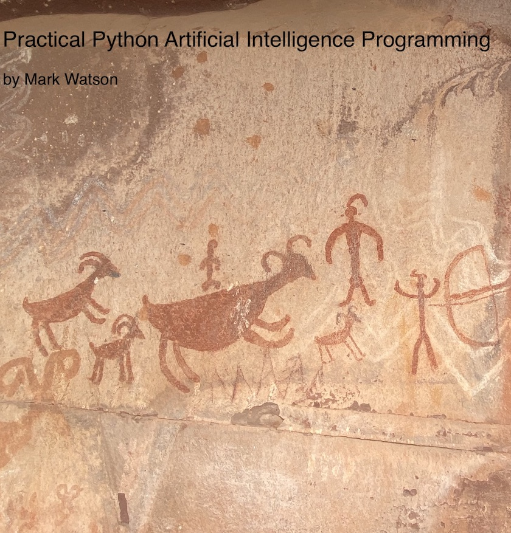

# Practical Python Artificial Intelligence Programming

Source code and manuscript for **Practical Python Artificial Intelligence Programming** by Mark Watson.

Copyright 2022-2024 Mark Watson. This book may be shared using the Creative Commons "share and share alike, no modifications, no commercial reuse" license. The example code is Apache 2 licensed.

This book covers a wide range of practical AI techniques in Python, from classic machine learning and symbolic AI to modern deep learning and large language models.



## Topics

- Python development environment setup
- Machine learning: classification, regression, clustering
- Exploratory data analysis and feature engineering
- Deep learning basics, NLP, and image generation
- Large Language Models: transformers, tokenizers, public APIs (OpenAI, Hugging Face), local models
- Reinforcement learning
- Recommendation systems
- Symbolic AI and knowledge representation (graph/relational databases, semantic web, linked data)

## Repository Structure

- **`manuscript/`** — Chapter markdown files and resources for the book
- **`source-code/`** — Example Python programs for each chapter:
  - `data_analysis_and_feature_engineering/`
  - `machine-learning/`
  - `regression_and_clustering/`
  - `deep_learning_basics/`
  - `deep_learning_nlp/`
  - `deep_learning_image_generation/`
  - `reinforcement_learning/`
  - `symbolic-AI/`

## Getting the Book

The book is available on Leanpub: [leanpub.com/pythonai](https://leanpub.com/pythonai)

## Example Code

Each source-code subdirectory uses `uv` for dependency management. To run an example:

```bash
cd source-code/deep_learning_nlp
uv sync
uv run python summarization.py
```

Some examples require API keys for Hugging Face (`HF_API_TOKEN`) or OpenAI (`OPENAI_KEY`), set as environment variables.

## About the Author

Mark Watson has written over 20 books, holds over 50 US patents, and has worked at Google, Capital One, SAIC, and others. Visit [markwatson.com](https://markwatson.com).