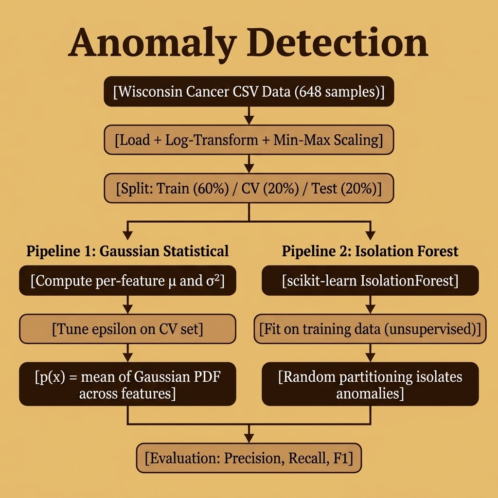

# Anomaly Detection – Source Code

This directory contains example code for the **Anomaly Detection** chapter, implementing two complementary approaches to anomaly detection on the Wisconsin Diagnostic Breast Cancer dataset.

## Approaches

1. **Gaussian Statistical Detector** — A from-scratch implementation that models per-feature Gaussian distributions (mean + variance) and flags observations whose aggregate probability falls below a tunable epsilon threshold. This is a direct port of the Java version from the companion *Java AI Book*.

2. **Isolation Forest Detector** — A scikit-learn wrapper around the industry-standard Isolation Forest algorithm, which isolates anomalies by random partitioning without needing labeled data.

## Running

```bash
uv run wisconsin_anomaly.py
```

This produces:
- Console output with precision, recall, and F1 for both detectors
- `histograms.png` — a 3×3 grid of per-feature histograms colour-coded by class

## Files

- **anomaly_detection.py** — Core module with `GaussianAnomalyDetector`, `IsolationForestDetector`, and `evaluate()` helper
- **wisconsin_anomaly.py** — Loads the Wisconsin cancer dataset, runs both detectors, prints evaluation metrics
- **cleaned_wisconsin_cancer_data.csv** — 648-sample dataset (9 features + class label)

## Architecture



## Copyright and License

Copyright 2024-2026 Mark Watson. All rights reserved.

This example is released using the Apache 2 license.
