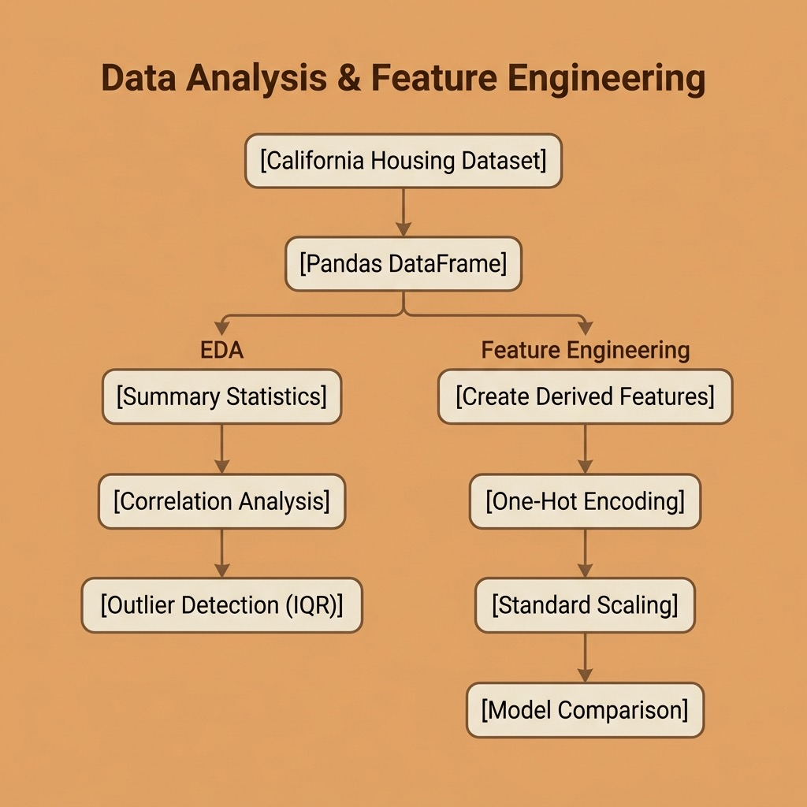

# Exploratory Data Analysis and Feature Engineering – Source Code

This directory contains example code for the **EDA and Feature Engineering** chapter.

## Running

```bash
uv run eda.py
uv run feature_engineering.py
```

## Files

- **eda.py** — Exploratory data analysis: summary statistics, correlations, missing values, and outlier detection on the California Housing dataset
- **feature_engineering.py** — Creating derived features, one-hot encoding, missing data imputation, feature scaling, and measuring the impact on model performance

## Architecture


