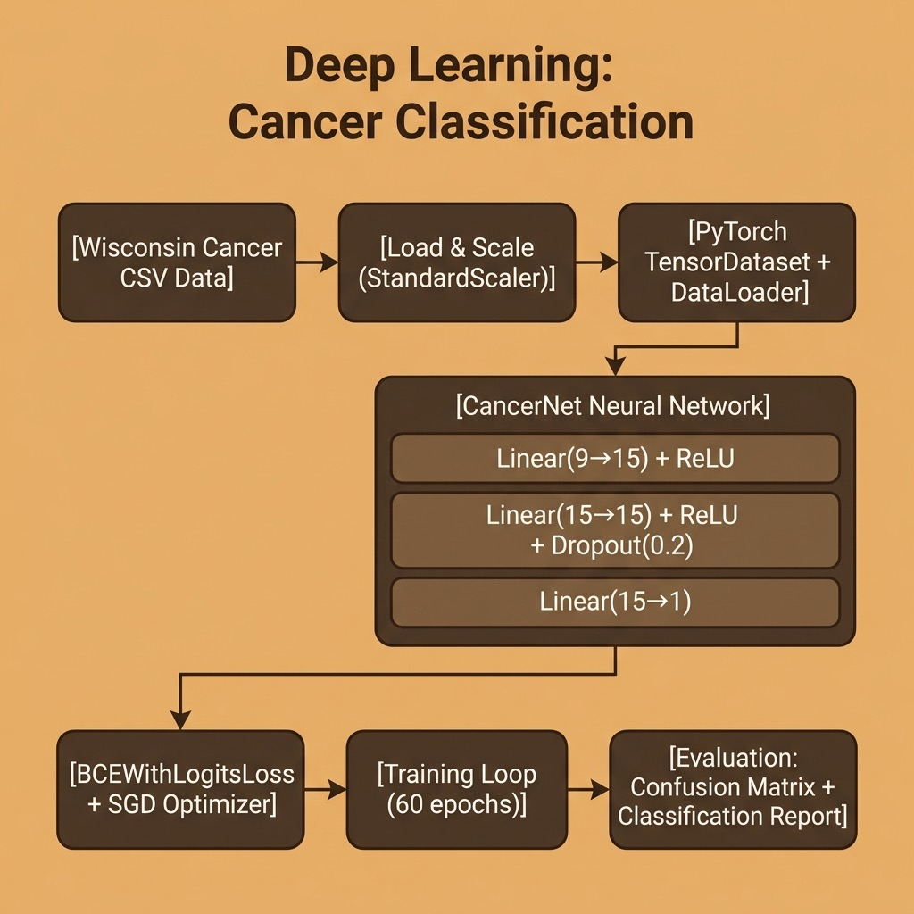

# Deep Learning Basics – Source Code

This directory contains example code for the **Basics of Deep Learning** chapter.

## Files

- **cancer_model.py** — PyTorch feedforward neural network (9 → 15 → 15 → 1) for cancer classification using the Wisconsin dataset.

## Data prerequisite

The script reads CSV files from `../machine-learning/`:
- `labeled_cancer_data.csv`
- `labeled_test_data.csv`

Make sure that directory has those files before running.

## Setup

Uses [`uv`](https://docs.astral.sh/uv/) for dependency management and [`just`](https://just.systems/) as the task runner.

```bash
# uv (macOS / Linux)
curl -LsSf https://astral.sh/uv/install.sh | sh
# just — the Rust task runner (do NOT install the Python "just" package from PyPI)
brew install just
```

Then install the deps:

```bash
uv sync
```

## Running

```bash
uv run python cancer_model.py
# or
make run
```

## Development workflow

```bash
just check       # fmt-check + lint + typecheck + test
just fmt         # format all Python files
just lint        # ruff --fix
just typecheck   # pyrefly (strict preset)
just test        # pytest with testmon (fast, only affected tests)
just test-all    # full parallel pytest run
```

Under Claude Code, `.claude/hooks/py-check.sh` runs after every edit (format + lint + per-file typecheck) and `.claude/hooks/py-stop.sh` runs the full gate before the turn ends. See `CLAUDE.md` for the full workflow contract.

## Architecture


