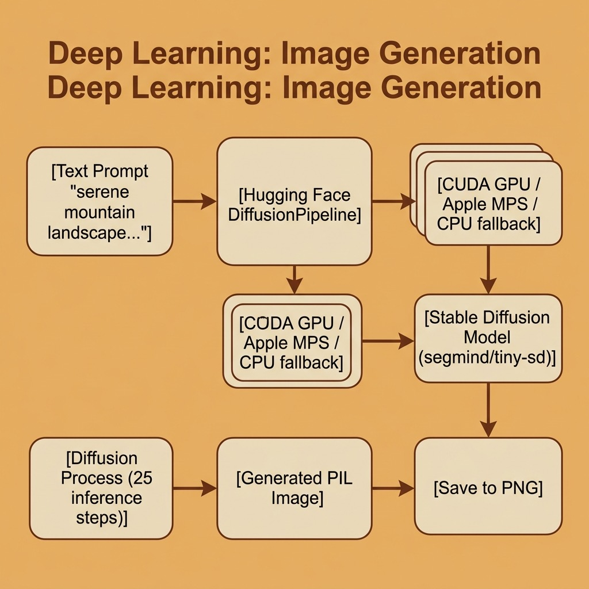

# Deep Learning Image Generation – Source Code

This directory contains example code for the **Overview of Image Generation** chapter.

## Files

- **image_generation.py** — Text-to-image generation using Stable Diffusion via the Hugging Face diffusers library (runs locally).
- **gemini_image_generation.py** — Text-to-image generation using Google's Imagen 4 via the Gemini API (cloud-based).
- **generated_landscape.png** — Sample output image (local model).
- **gemini_generated_landscape.png** — Sample output image (Gemini Imagen).

## Setup

Uses [`uv`](https://docs.astral.sh/uv/) for dependency management and [`just`](https://just.systems/) as the task runner.

```bash
# uv (macOS / Linux)
curl -LsSf https://astral.sh/uv/install.sh | sh
# just — the Rust task runner (do NOT install the Python "just" package from PyPI)
brew install just
```

Then install the deps:

```bash
uv sync
```

## Running the Local Stable Diffusion Example

```bash
uv run python image_generation.py
# or
make local
```

Example very low-res generated image (prompt: "a serene mountain landscape at sunset, oil painting style"):


The Stable Diffusion model weights (~1.1 GB) are downloaded automatically on first run. A GPU (CUDA or Apple Silicon MPS) is strongly recommended for reasonable generation speed.

## Running the Gemini Imagen API Example

```bash
export GOOGLE_API_KEY="your-key-here"
uv run python gemini_image_generation.py
# or
make gemini
```

This example uses Google's Imagen 4 model via the Gemini API — no local GPU or large model downloads required. The generated image is saved to `gemini_generated_landscape.png`.

Example Gemini-generated image (same prompt):


## Development workflow

```bash
just check       # fmt-check + lint + typecheck + test
just fmt         # format all Python files
just lint        # ruff --fix
just typecheck   # pyrefly (strict preset)
just test        # pytest with testmon (fast)
just test-all    # full parallel pytest run
```

Under Claude Code, `.claude/hooks/py-check.sh` runs after every edit (format + lint + per-file typecheck) and `.claude/hooks/py-stop.sh` runs the full gate before the turn ends. See `CLAUDE.md` for the full workflow contract.

## Architecture


