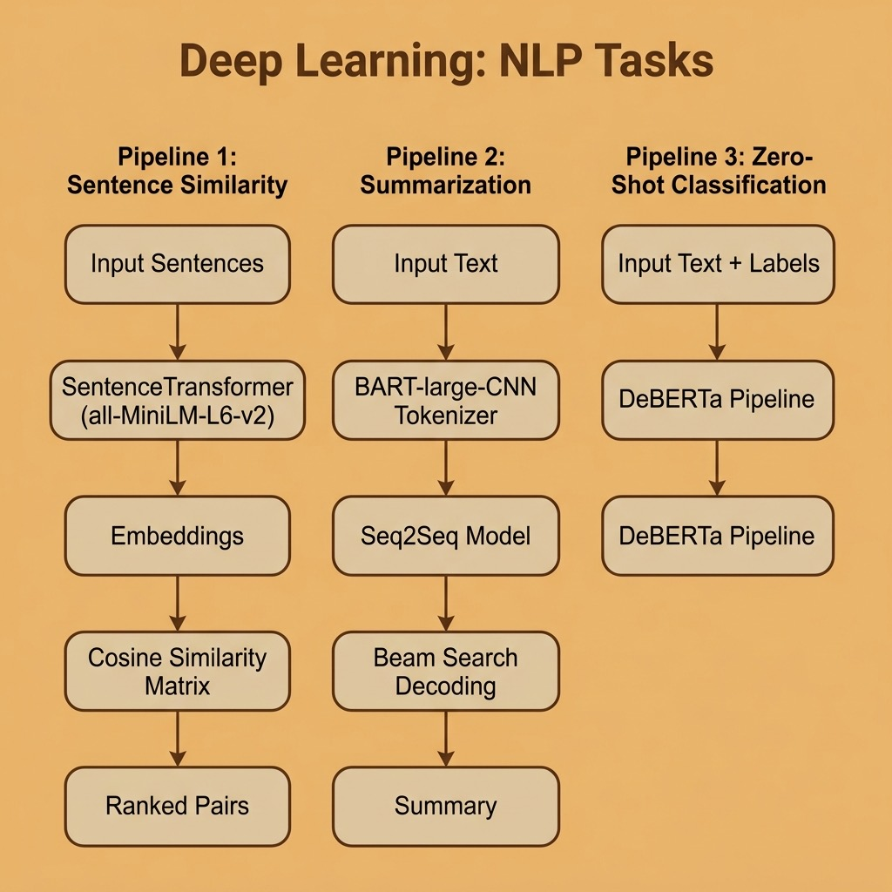

# Deep Learning NLP – Source Code

This directory contains example code for the **Natural Language Processing Using Deep Learning** chapter.

## Running

```bash
uv run summarization.py
uv run zero_shot_classification.py
uv run sentence_similarity.py
```

Models are downloaded automatically to `~/.cache/huggingface` on first run.

## Files

- **summarization.py** — Text summarization using the facebook/bart-large-cnn model
- **zero_shot_classification.py** — Zero-shot text classification using DeBERTa
- **sentence_similarity.py** — Sentence embedding and cosine similarity using sentence-transformers

## Architecture


