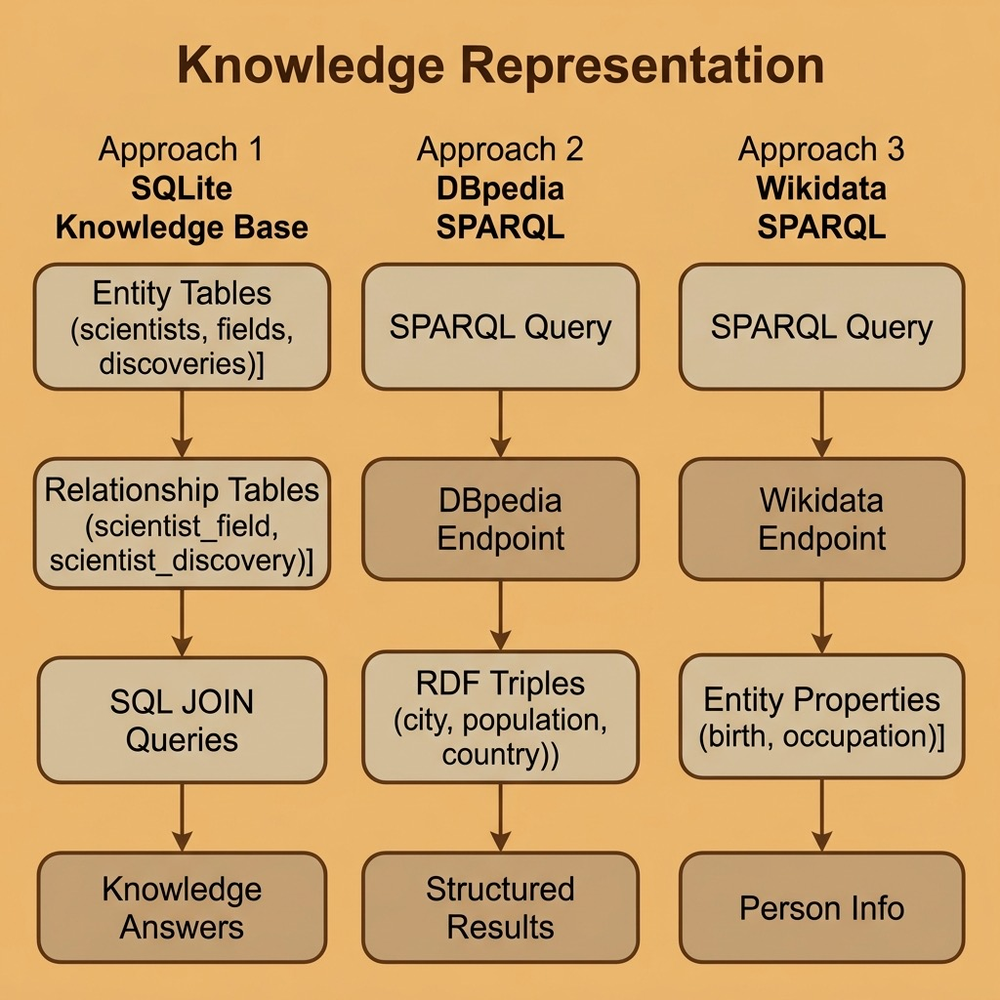

# Knowledge Representation – Source Code

This directory contains example code for the **Knowledge Representation with Graph and Relational Databases** chapter.

## Files

- **wikidata_person.py** — Query Wikidata for information about a person (birth place, occupations).
- **dbpedia_cities.py** — Query DBPedia for cities with population data.
- **sqlite_lib.py** — Reusable SQLite helper functions.
- **sqlite_knowledge.py** — Knowledge base with entity/relationship tables and JOIN queries.

## Setup

Uses [`uv`](https://docs.astral.sh/uv/) for dependency management and [`just`](https://just.systems/) as the task runner.

```bash
# uv (macOS / Linux)
curl -LsSf https://astral.sh/uv/install.sh | sh
# just — the Rust task runner (do NOT install the Python "just" package from PyPI)
brew install just

uv sync
```

## SPARQL Examples (Wikidata and DBPedia)

```bash
uv run python wikidata_person.py
uv run python dbpedia_cities.py
# or
make wikidata
make dbpedia
```

## SQLite Example (no external endpoints)

```bash
uv run python sqlite_knowledge.py
# or
make sqlite
```

## Development workflow

```bash
just check       # fmt-check + lint + typecheck + test
just fmt         # format all Python files
just lint        # ruff --fix
just typecheck   # pyrefly (strict preset)
just test        # pytest with testmon (fast)
just test-all    # full parallel pytest run
```

Under Claude Code, `.claude/hooks/py-check.sh` runs after every edit (format + lint + per-file typecheck) and `.claude/hooks/py-stop.sh` runs the full gate before the turn ends. See `CLAUDE.md` for the full workflow contract.

## Architecture


