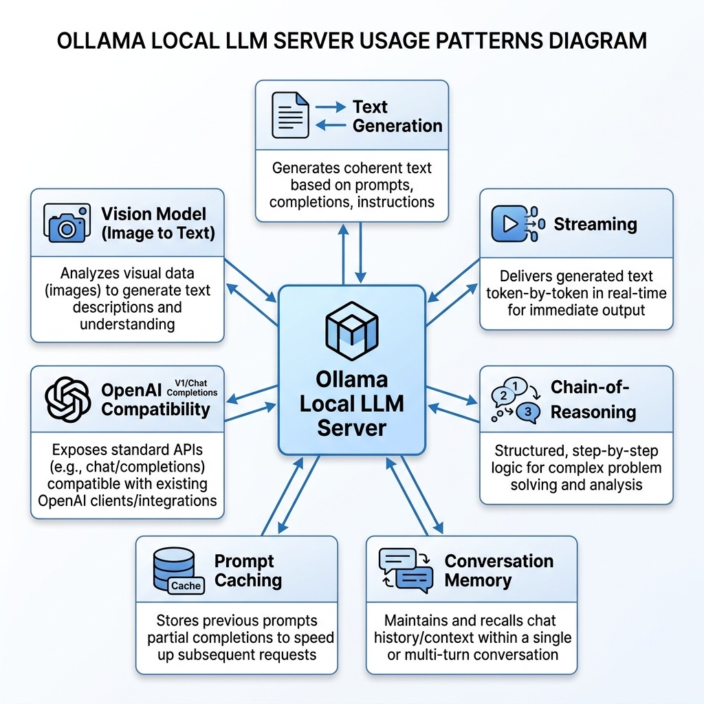

# LLM Local Models – Source Code

This directory contains example code for the **LLMs with Local Models** chapter.

## Architecture



## Prerequisites

Install [Ollama](https://ollama.com):

```bash
brew install ollama    # macOS
ollama serve           # start the service
```

Pull the models used in the examples:

```bash
ollama pull llama3.2:3b
ollama pull deepseek-r1:7b    # for reasoning example
ollama pull qwen3.5:0.8b      # or another vision-capable model for the image demo
```

## Setup

Uses [`uv`](https://docs.astral.sh/uv/) for dependency management and [`just`](https://just.systems/) as the task runner.

```bash
# uv (macOS / Linux)
curl -LsSf https://astral.sh/uv/install.sh | sh
# just — the Rust task runner (do NOT install the Python "just" package from PyPI)
brew install just

uv sync
```

## Examples

- **ollama_text.py** — Basic text generation with a local model.
- **ollama_streaming.py** — Streaming responses for real-time output.
- **ollama_reasoning.py** — Chain-of-thought reasoning with DeepSeek-R1.
- **ollama_memory.py** — Multi-turn conversation with history.
- **ollama_caching.py** — Prompt caching benchmark (cold vs warm start).
- **ollama_openai_compat.py** — Using the OpenAI SDK with local Ollama.
- **image_to_text_description.py** — Generating detailed image descriptions using a vision model.

## Running

```bash
uv run python ollama_text.py
uv run python ollama_streaming.py
uv run python ollama_reasoning.py
uv run python ollama_memory.py
uv run python ollama_caching.py
uv run python ollama_openai_compat.py
uv run python image_to_text_description.py
```

Or via `make text` / `make streaming` / `make reasoning` / … (see `Makefile`).

## Development workflow

```bash
just check       # fmt-check + lint + typecheck + test
just fmt         # format all Python files
just lint        # ruff --fix
just typecheck   # pyrefly (strict preset)
just test        # pytest with testmon (fast)
just test-all    # full parallel pytest run
```

Under Claude Code, `.claude/hooks/py-check.sh` runs after every edit (format + lint + per-file typecheck) and `.claude/hooks/py-stop.sh` runs the full gate before the turn ends. See `CLAUDE.md` for the full workflow contract.
