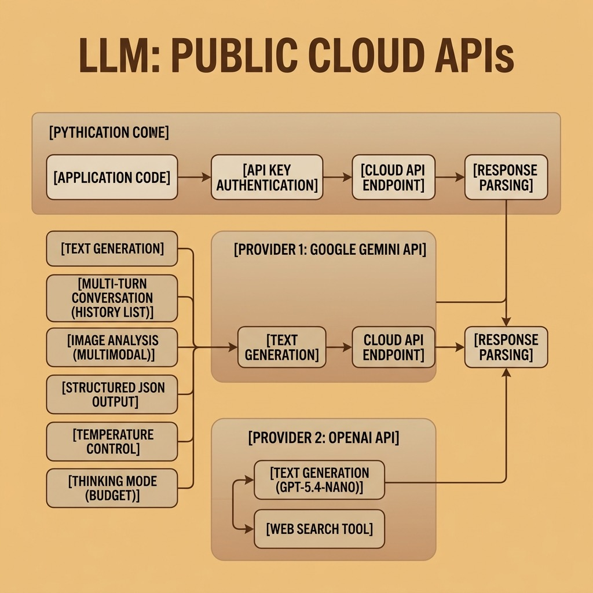

# LLM Public APIs – Source Code

This directory contains example code for the **LLMs with Public APIs** chapter.

Every script drives its provider through [`litellm`](https://github.com/BerriAI/litellm),
the uniform LLM interface: models are named `"provider/model-name"`
(`gemini/gemini-3-flash-preview`, `openai/gpt-5.4-nano`,
`fireworks_ai/accounts/fireworks/models/deepseek-v4p1-flash`, …). litellm speaks
to the providers' OpenAI-compatible endpoints, so `google-genai`, `openai` and
Pillow are not needed directly — `uv sync` installs litellm from PyPI.

## Setup

Uses [`uv`](https://docs.astral.sh/uv/) for dependency management and [`just`](https://just.systems/) as the task runner.

```bash
# uv (macOS / Linux)
curl -LsSf https://astral.sh/uv/install.sh | sh
# just — the Rust task runner (do NOT install the Python "just" package from PyPI)
brew install just

uv sync   # installs litellm
```

## Google Gemini Examples

Requires a Google AI API key ([get one here](https://aistudio.google.com/apikey)):

```bash
export GOOGLE_API_KEY="your-api-key"
```

- **gemini_text.py** — Basic text generation.
- **gemini_temperature.py** — Effect of temperature on output creativity.
- **gemini_thinking.py** — Extended reasoning with a reduced thinking budget.
- **gemini_conversation.py** — Multi-turn conversation with history.
- **gemini_image.py** — Multimodal image analysis (requires a `photo.jpg`).
- **gemini_structured.py** — Extracting structured JSON from text.

## OpenAI Examples

Requires an OpenAI API key ([get one here](https://platform.openai.com/api-keys)):

```bash
export OPENAI_API_KEY="your-api-key"
```

These two use the OpenAI **Responses API** through `litellm.responses()`.

- **openai_text.py** — Basic text generation with GPT-5.4-nano.
- **openai_search.py** — Web-search-augmented generation (`{"type": "web_search_preview"}`).

## Fireworks.ai Examples

Requires a Fireworks API key ([get one here](https://fireworks.ai/api-keys)):

```bash
export FIREWORKS_API_KEY="your-api-key"
```

Fireworks exposes an OpenAI-compatible API, which is the protocol litellm
speaks to every provider. The default model is `deepseek-v4p1-flash`.

- **fireworks_text.py** — Basic text generation.
- **fireworks_temperature.py** — Effect of temperature on output creativity.
- **fireworks_thinking.py** — Extended reasoning with DeepSeek thinking mode.
- **fireworks_conversation.py** — Multi-turn conversation with history.
- **fireworks_structured.py** — Extracting structured JSON from text.

## NVIDIA Examples

Requires a free NVIDIA NIM key ([get one here](https://build.nvidia.com)):

```bash
export NVIDIA_API_KEY="your-api-key"
```

The helpers model NIM as `nvidia_nim/<model>` and pass `NVIDIA_API_KEY`
explicitly on every call, because litellm's NIM provider otherwise looks for
`NVIDIA_NIM_API_KEY`.

- **NVIDIA_client.py** — A small library of `complete` / `chat` helpers, plus the endpoint and model id that `../NVIDIA_Object_Oriented_Agents` reuses.

## Running

```bash
uv run python gemini_text.py
uv run python openai_text.py
uv run python fireworks_text.py
# … etc
```

Or via `make gemini-text` / `make openai-text` / `make fireworks-text` / … (see `Makefile`).

## Development workflow

```bash
just check       # fmt-check + lint + typecheck + test
just fmt         # format all Python files
just lint        # ruff --fix
just typecheck   # pyrefly (strict preset)
just test        # pytest with testmon (fast)
just test-all    # full parallel pytest run
```

Under Claude Code, `.claude/hooks/py-check.sh` runs after every edit (format + lint + per-file typecheck) and `.claude/hooks/py-stop.sh` runs the full gate before the turn ends. See `CLAUDE.md` for the full workflow contract.

## Architecture


