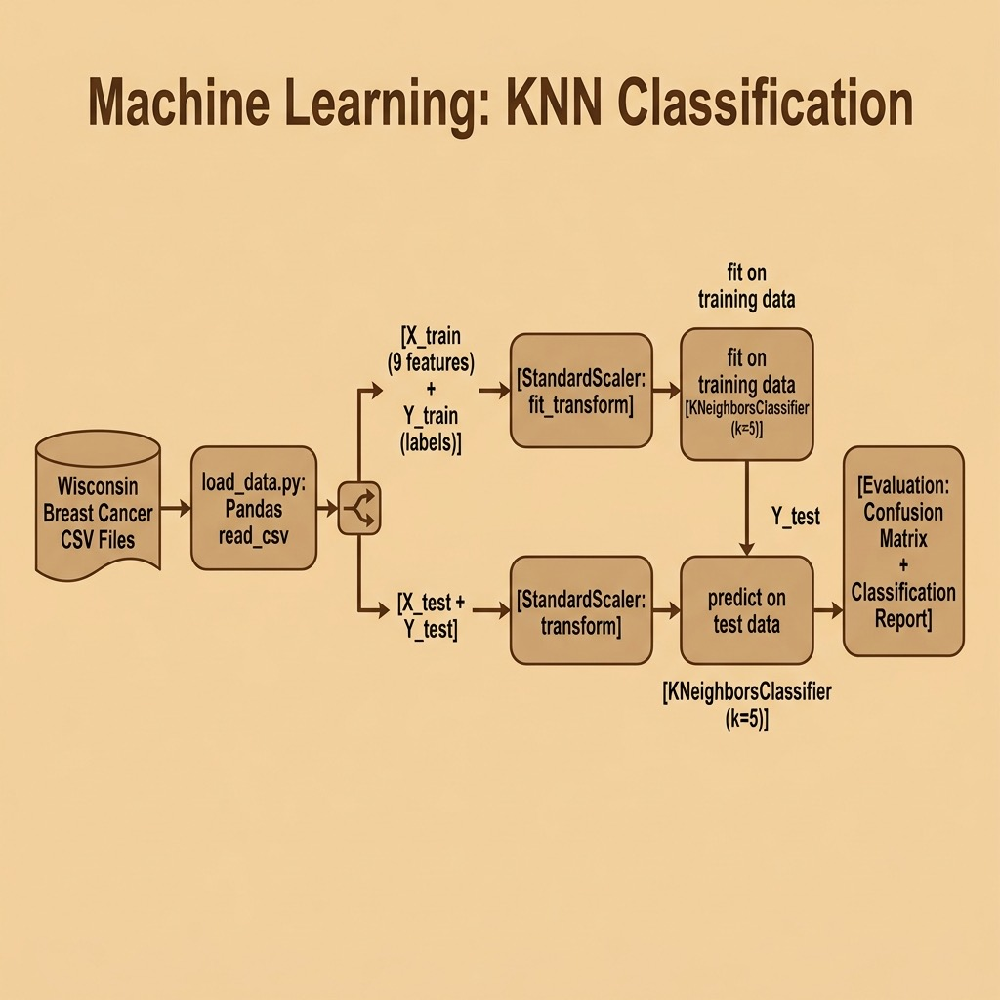

# Machine Learning – Source Code

This directory contains example code for the **"Classic" Machine Learning** chapter.

## Running

```bash
uv run classification.py
```

## Files

- **load_data.py** — Load and prepare the Wisconsin cancer dataset from CSV files
- **classification.py** — K-Nearest Neighbors classifier using scikit-learn
- **labeled_cancer_data.csv** — Training data (554 samples)
- **labeled_test_data.csv** — Test data (15 samples)

## Architecture



## Development workflow

Uses [`uv`](https://docs.astral.sh/uv/) for dependency management and [`just`](https://just.systems/) as the task runner. Install both, then:

```bash
uv sync
just check       # fmt-check + lint + typecheck + test
just fmt         # ruff format
just lint        # ruff --fix
just typecheck   # pyrefly (strict)
just test        # pytest with testmon (fast)
just test-all    # full parallel pytest run
```

Under Claude Code, `.claude/hooks/py-check.sh` runs after every edit (format + lint + per-file typecheck) and `.claude/hooks/py-stop.sh` runs the full gate before the turn ends. See `CLAUDE.md` for the workflow contract.
