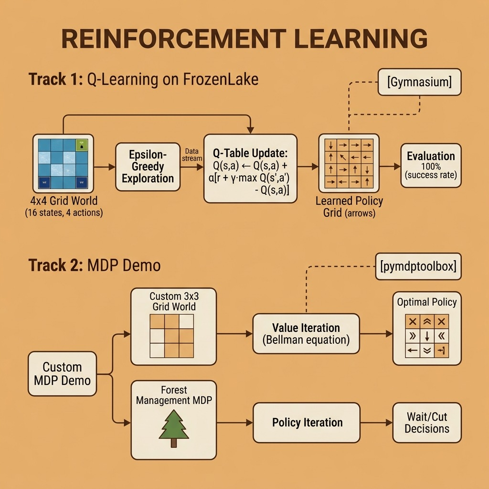

# Reinforcement Learning – Source Code

This directory contains example code for the **Overview of Reinforcement Learning** chapter.

## Running

```bash
uv run mdp_demo.py
uv run frozen_lake_qlearning.py
```

## Files

- **mdp_demo.py** — Markov Decision Process examples: a 3×3 grid world solved with value iteration and policy iteration, plus the built-in forest management problem (uses pymdptoolbox)
- **frozen_lake_qlearning.py** — Q-learning agent trained on the Gymnasium FrozenLake environment, with both slippery and deterministic variants

## Architecture



## Development workflow

Uses [`uv`](https://docs.astral.sh/uv/) for dependency management and [`just`](https://just.systems/) as the task runner. Install both, then:

```bash
uv sync
just check       # fmt-check + lint + typecheck + test
just fmt         # ruff format
just lint        # ruff --fix
just typecheck   # pyrefly (strict)
just test        # pytest with testmon (fast)
just test-all    # full parallel pytest run
```

Under Claude Code, `.claude/hooks/py-check.sh` runs after every edit (format + lint + per-file typecheck) and `.claude/hooks/py-stop.sh` runs the full gate before the turn ends. See `CLAUDE.md` for the workflow contract.
